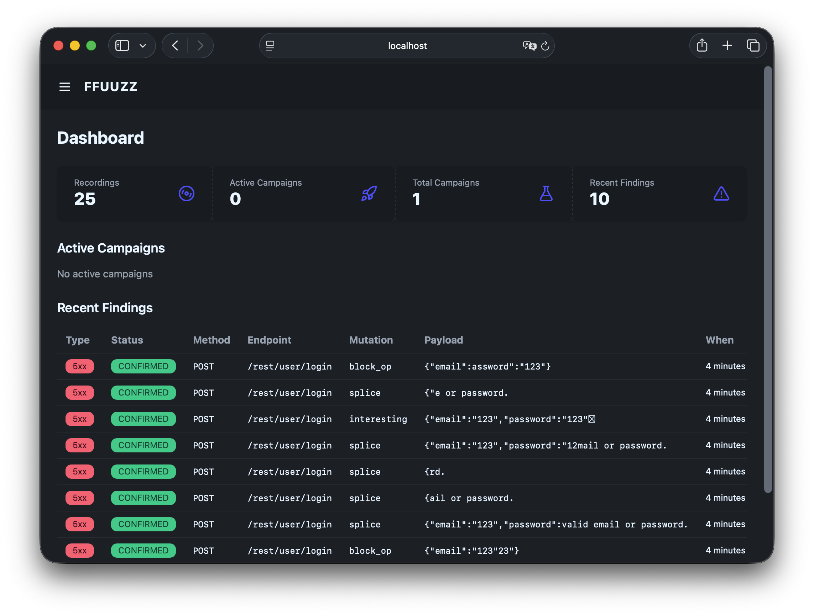

# FFUUZZ
[](https://github.com/v0lka/ffuuzz/actions/workflows/tests.yml)


FFUZZ is a web application security testing tool that combines MITM proxy traffic recording with intelligent mutation-based fuzzing. It captures HTTP/HTTPS traffic, replays it with various mutations, and detects anomalies that may indicate security vulnerabilities.



## Quick Start

### Prerequisites

- Go 1.25+
- Node.js 20+ (for UI development)
- PostgreSQL 16+ (or use Docker Compose)

### Installation

```bash
git clone <repository-url>
cd ffuuzz

# Start PostgreSQL
docker-compose up -d postgres

# Build the application
make build

# Run the server
./ffuuzz serve
```

- Proxy: `http://localhost:8080`
- Web UI: `http://localhost:8081`

### Development

```bash
make dev-frontend   # Frontend dev server with HMR
make dev-backend    # Backend via go run
make test           # Run tests with race detector
make lint           # Run linters
```

## Documentation

- **[User Guide](docs/user-guide.md)** -- Installation, configuration, usage workflow, mutation operators, anomaly detection, and full REST API reference.
- **[Contributing](docs/contributing.md)** -- Development setup, project structure, architecture overview, key packages, and guidelines for adding new features.

## License

[License](LICENSE)
