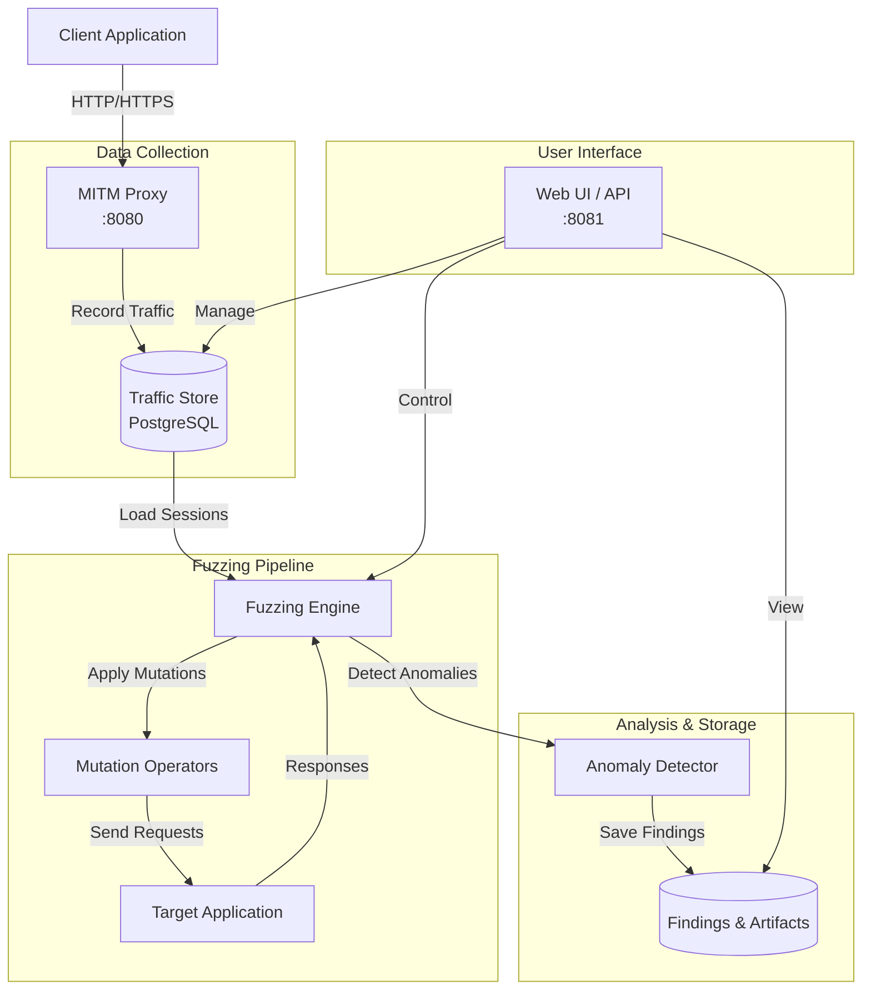

# FFUZZ

FFUZZ is a web application security testing tool that combines MITM proxy traffic recording with intelligent mutation-based fuzzing. It captures HTTP/HTTPS traffic, replays it with various mutations, and detects anomalies that may indicate security vulnerabilities.

## Features

- **MITM Proxy**: Intercept and decrypt HTTPS traffic with automatic certificate management
- **Traffic Recording**: Capture complete request/response exchanges for later analysis
- **Mutation Testing**: Apply intelligent mutations to headers, query parameters, and JSON bodies
- **Anomaly Detection**: Identify server errors, timeouts, latency regressions, and pattern matches
- **Campaign Management**: Organize fuzzing campaigns with configurable limits and strategies
- **Web Dashboard**: React-based UI for managing recordings, campaigns, and findings
- **Diff Analysis**: Compare responses to identify behavioral changes

## Architecture



## Quick Start

### Prerequisites

- Go 1.25+
- Node.js 20+ (for UI development)
- PostgreSQL 16+ (or use Docker Compose)

### Installation

```bash
# Clone the repository
git clone <repository-url>
cd ffuuzz

# Start PostgreSQL (and optional GoVWA target)
docker-compose up -d postgres          # PostgreSQL only

# Build the application
make build

# Run the server
./ffuuzz serve
```

The application will be available at:
- Proxy: `http://localhost:8080`
- Web UI: `http://localhost:8081`

### Usage

#### 1. Capture Traffic

Configure your application or browser to use the proxy at `localhost:8080`. FFUZZ will automatically generate certificates for HTTPS interception.

Install the CA certificate (located at `certs/ca.pem`) into your system/browser trust store for seamless HTTPS interception.

#### 2. Create a Fuzzing Campaign

Navigate to the Web UI at `http://localhost:8081` and create a new campaign:

1. Select recorded traffic sessions as seeds
2. Configure target URL
3. Set mutation parameters (headers, JSON body, query parameters)
4. Define anomaly detection rules
5. Set resource limits (workers, RPS, duration)

#### 3. Run the Campaign

Start the campaign from the UI or via API. The engine will:

- Replay recorded requests with mutations
- Detect anomalies based on configured rules
- Save findings with full request/response artifacts
- Generate real-time statistics

#### 4. Analyze Findings

Review findings in the Web UI:

- Filter by type (timeout, server error, latency regression, regex match)
- View full request/response details
- Download artifacts for reproduction
- Confirm and minimize findings

## Commands

```bash
# Run full server (proxy + API + engine)
ffuuzz serve [flags]

# Run proxy only (development mode)
ffuuzz proxy -port 8080 -out log.jsonl

# Analyze recorded JSONL log
ffuuzz record -in log.jsonl
```

## Configuration

Configuration can be provided via environment variables or CLI flags:

| Environment Variable | CLI Flag | Default | Description |
|---------------------|----------|---------|-------------|
| `FFUUZZ_API_ADDRESS` | `-a` | `:8081` | Control API listen address |
| `FFUUZZ_PROXY_ADDRESS` | `-p` | `:8080` | MITM proxy listen address |
| `FFUUZZ_DATABASE_URI` | `-d` | `postgres://...` | PostgreSQL connection URI |
| `FFUUZZ_ARTIFACT_DIR` | `-o` | `./artifacts` | Artifact storage directory |
| `FFUUZZ_WORKERS` | | `8` | Number of fuzzing workers |
| `FFUUZZ_RPS` | | `50` | Requests per second limit |

## Development

```bash
# Run frontend in development mode
make dev-frontend

# Run backend in development mode
make dev-backend

# Run tests
make test

# Run linters
make lint

# Clean build artifacts
make clean
```

## Project Structure

```
.
├── cmd/
│   └── ffuuzz/       # Application entry point
├── internal/
│   ├── api/          # REST API and web server
│   ├── anomaly/      # Anomaly detection
│   ├── config/       # Configuration management
│   ├── corpus/       # Test corpus manager
│   ├── db/           # Database models and migrations
│   ├── diff/         # Response comparison
│   ├── engine/       # Fuzzing engine and workers
│   ├── logging/      # Logging setup
│   ├── metrics/      # Prometheus metrics
│   ├── mitm/         # MITM proxy implementation
│   ├── model/        # Data models
│   ├── mutate/       # Mutation operators
│   ├── recorder/     # Traffic recording
│   ├── replayer/     # Request replayer
│   ├── report/       # Report generation
│   ├── store/        # Certificate store
│   ├── triage/       # Finding triage and confirmation
│   └── util/         # Utilities
├── web/              # React frontend
└── certs/            # CA certificates
```

## Mutation Operators

FFUZZ includes several mutation strategies:

- **Path/Query**: Inject SQLi, path traversal, command injection payloads
- **Headers**: Mutate Content-Type, Authorization, custom headers
- **JSON Body**: Type confusion, boundary values, format string injections
- **Primitives**: Bit flips, truncation, boundary values

## Anomaly Detection

Findings are categorized as:

- **TIMEOUT**: Request exceeded configured timeout
- **SERVER_ERROR**: HTTP 5xx response received
- **LATENCY_REGRESSION**: Response time significantly higher than baseline
- **REGEX_MATCH**: Response matches configured pattern (e.g., error messages)

## Testing Target (GoVWA)

For testing purposes, a vulnerable web application ([GoVWA](https://github.com/0c34/govwa)) is included in the Docker Compose setup. GoVWA is a deliberately vulnerable web application designed for learning web application security testing.

### Starting GoVWA

```bash
docker-compose up -d --build
```

This starts:
- PostgreSQL on port `5432`
- GoVWA on port `8888`
- GoVWA MySQL on port `3307`

### GoVWA Credentials

| Username | Password |
|----------|----------|
| admin | govwaadmin |
| user1 | govwauser1 |

### Using with FFUZZ

1. Configure FFUZZ proxy in your browser: `localhost:8080`
2. Navigate to `http://localhost:8888` and log in
3. Browse GoVWA features - FFUZZ will capture the traffic
4. Create a fuzzing campaign targeting `http://localhost:8888`

> **Warning**: GoVWA is intentionally vulnerable. Only run it in isolated local environments.

## License

[License](LICENSE)
